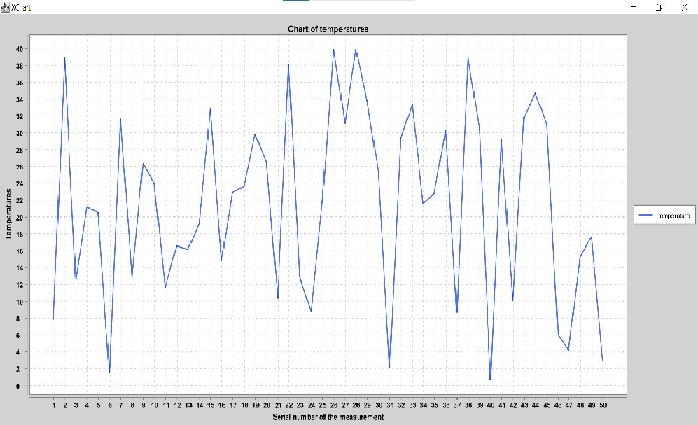
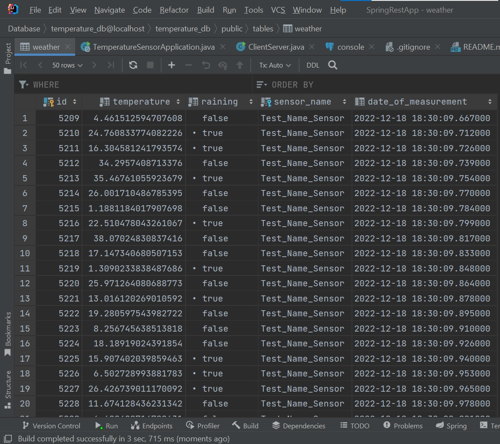

# Учебный проект "REST API сервис для метеорологического датчика"

(стек применяемых технологий: *Spring Framework, Spring REST, Spring Boot, Spring Data JPA, PostgreSQL, Hibernate,
XChar*)

**Описание:**

Есть метеорологический датчик (далее - сенсор). Этот датчик измеряет температуру окружающего воздуха и может определять
идет дождь или нет. Мы хотим получать
данные с сенсора и сохранять их в БД, чтобы далее анализировать.
Было создано REST API приложение для этого.

Функционал:

1) При POST запросе на /sensors/registration: 
   Регистрируется новый сенсор в системе. Происходит валидация данных о сенсоре. Если сенсор с таким названием есть в БД - клиенту возвращается сообщение.

2) При POST запросе на /measurements/add: 
   Добавляется новое измерение. Вещественное поле "temperature" содержит значение температуры воздуха, булево поле "raining" содержит значение true/false в зависимости от того, зарегистрировал ли сенсор дождь или нет. Помимо этого, в
   этом запросе передается сам объект сенсора, который получил и отправляет эти "измерения".
   Значения температуры воздуха, дождя сохраняются в таблице в БД. Также, в каждой строке этой
   таблицы содержится название того сенсора, который прислал эти измерения и дата записи измерения. Все поля
   валидируются.

3) При GET запросе на /measurements: 
   Возвращаются все измерения из БД.

4) При GET запросе на /measurements/rainyDaysCount: 
   Возвращается количество дождливых дней из БД.

5) Может быть построен график полученных с сервера температур.

Для тестирования работы программы был создан Клиент (класс ClientServer).

## Изображения работы программы:

<u>**1. График температур**</u>

<u>**2. Пример таблицы из БД со значениями с датчика**</u>

